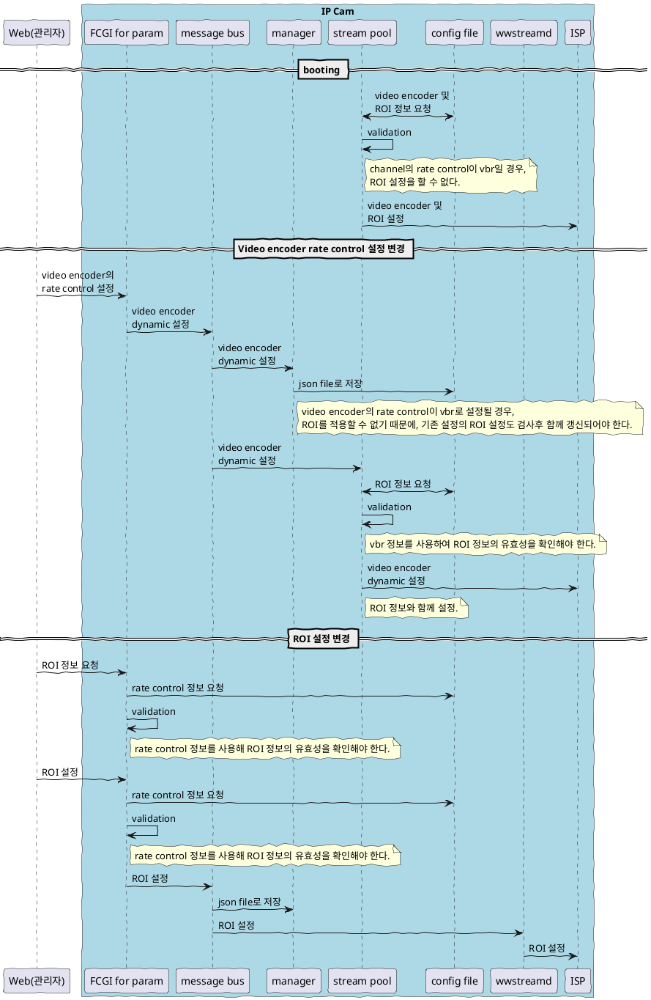
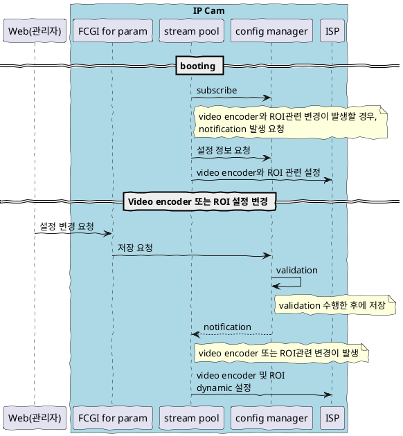

# Configuration

## Video encoder 및 ROI 관련 configuration access flow

### 기존 방식

|개선 항목| 설명 |
|-|-|
|단일 책임 원칙| configuration의 validation의 책임이 여러 모듈에 걸쳐 중복 구현되고 있음.|
|처리 순서에 대한 보장 어려움| video encoder의 rate control을 설정할때 message bus에 의해 broadcasting된 message들로 인해 json file로 저장되는 동시에 ISP로의 설정 변경도 함께 시도 된다. ISP 설정 전에 ROI 값을 읽어와야 하는데 이때 vbr의 설정값이 반영되어 validation이 끝난 값인지 확인할 방법이 없기 때문에, 또다시 validation을 수행 해야한다.|

### 신규 방식(검토중)

|개선 항목| 설명 |
|-|-|
|단일 책임 원칙| configuration의 validation의 책임은 config manager에게 부과한다.|
|처리 순서에 대한 보장 어려움| 설정 변경 요청 message는 broadasting 되지 않으며, 오직 config manage 만 받아서 처리한다. 다른 모듈들은 설정 정보중에서 관심이 있는 항목들에 대해 구독을 하여 변경사항을 통지 받게 한다. 이렇게 하면, 설정 요청 -> validation -> 저장 -> notification이 순차적 발생하도록 보장할 수 있게 된다. |

## 구현 순서

모든 구현에 대해 refactoring을 한번에 진행할 수는 없기 때문에, 점차적인 진행을 해야한다.
이를위해, configuration manager를 먼저 별개의 process로 구현하고, 기 구현되어 있는 모듈들에 점차적으로 적용하도록 한다.

## Configuration Manager

